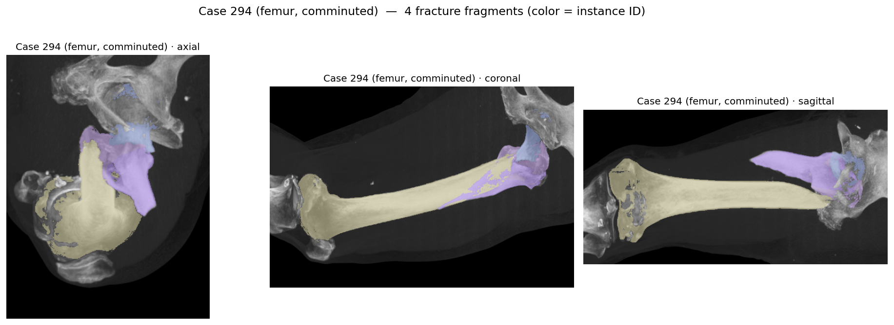
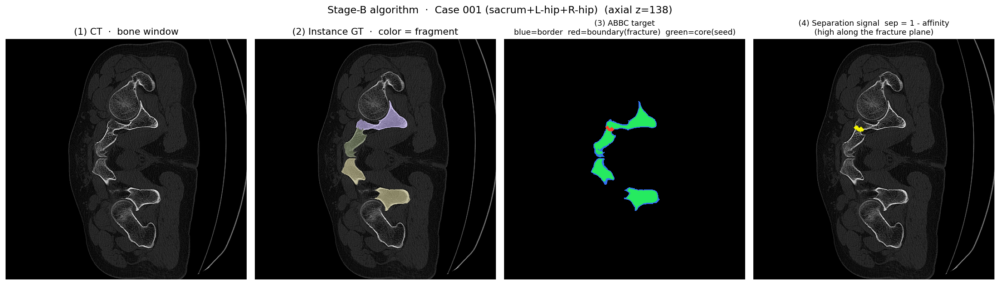

# PENGWIN 2026 — Task 1 골절 조각 인스턴스 분할

[](LICENSE)
[](#1-과제와-최종-보존-상태)
[](#7-빌드와-검증)
[](#8-전체-submission-snapshot)

골반·대퇴 CT에서 Sacrum, Left/Right Hip, Femur를 찾고, 서로 맞닿아 있는 골절 조각을
각각의 instance ID로 분리하는 2-stage nnU-Net/STU-Net 파이프라인이다. 이 저장소는 대회 종료 후
원본 release `v3.12@eac5e1f`를 기준으로 최종 runtime, 모델 provenance와 검증 문서를 정리한
보존본이다.

<table>
  <tr>
    <td width="50%"></td>
    <td width="50%"></td>
  </tr>
  <tr>
    <td align="center">골반 예시: Sacrum과 Left/Right Hip의 조각 ID</td>
    <td align="center">대퇴골 예시: comminuted Femur 조각 ID</td>
  </tr>
</table>

이미지는 익명화된 challenge case의 정성 예시이며 정량 성능을 대신하지 않는다.

## 목차

1. [과제와 최종 보존 상태](#1-과제와-최종-보존-상태)
2. [최종 GC 결과](#2-최종-gc-결과)
3. [전체 파이프라인](#3-전체-파이프라인)
4. [학습 출력과 loss](#4-학습-출력과-loss)
5. [추론과 instance decode](#5-추론과-instance-decode)
6. [입출력·저장소 구조](#6-입출력저장소-구조)
7. [빌드와 검증](#7-빌드와-검증)
8. [전체 submission snapshot](#8-전체-submission-snapshot)
9. [재현성 경계](#9-재현성-경계)

## 1. 과제와 최종 보존 상태

| 항목 | 최종 보존값 |
|---|---|
| 과제 | 3D 골절 조각 instance segmentation |
| 입력 | `pelvic-fracture-ct.mha` |
| 출력 | 입력과 동일 geometry의 instance label `.mha` |
| source 기준 | immutable tag `v3.12`, commit `eac5e1f` |
| Stage A | `PengwinTrainerSTUNetBaseAnatomyV301`, fold 0, 5 classes |
| Stage B | V308 Sacrum/Hip/Femur experts, fold 0, 13 outputs |
| 최종 payload | V301 + V308 experts + RF router |
| payload SHA-256 | `049c38ea4abf1629a4d5f79a68a27918fd4103941fbf4f500b76211e93192919` |
| GC 대표 행 | `harp3133t`, comment `v3.5`, Final 16/43, MP 17.1 |
| 상태 | competition closed, read-only preservation |

`16/43`은 GC API가 반환한 account/submission 행 순위다. 동일 팀의 여러 계정을 제거한 공식 팀
순위로 해석하지 않는다.

## 2. 최종 GC 결과

GET-only snapshot `20260818T140325Z`에서 확인한 `harp3133t v3.5` Final 집계다.

| 축 | 지표 | 값 | 방향 |
|---|---|---:|:---:|
| overlap | Fragment Dice | 0.8803 | ↑ |
| overlap | Fragment Local Dice | 0.8717 | ↑ |
| surface | HD95 | 11.1034 mm | ↓ |
| surface | ASSD | 3.0633 mm | ↓ |
| instance | Recall | 0.8909 | ↑ |
| instance | Precision | 0.9122 | ↑ |
| instance | F1 | 0.8902 | ↑ |
| topology | Merge error count | 0.3042 | ↓ |
| topology | Split error count | 0.0625 | ↓ |
| topology | Topology consistency | 0.8188 | ↑ |
| leaderboard | Mean Position | 17.1 | ↓ |

평가 ID는 `d70c767c-d680-44fa-af9c-3ab9d947c3c0`, submission ID는
`185c1b0a-32c9-4307-ae57-0f1c96ae13be`이며 160/160 case가 성공했다.

## 3. 전체 파이프라인

```text
CT (.mha)
  │
  ├─ Stage A: V301 5-class anatomy
  │    └─ background / Sacrum / LeftHip / RightHip / Femur
  │
  ├─ target-family router
  │    └─ RF confidence + official rule fallback → pelvic 또는 femur
  │
  ├─ anatomy ROI 생성
  │    └─ Sacrum / Hip / Femur expert 선택
  │
  ├─ Stage B: V308 13-channel prediction
  │    └─ 4 ABBC + 9 short/long affinity
  │
  ├─ average-linkage agglomeration
  │    └─ 기본 T=0.75, Femur conditional retry T=0.15
  │
  └─ 원본 CT geometry로 instance label 복원
```



Stage A는 전체 anatomy를 먼저 찾고, Stage B는 anatomy별 ROI에서 골절면과 조각 연결성을 학습한다.
이 분리는 골반 전체 FOV와 작은 골절면을 한 번에 처리할 때 생기는 memory·class imbalance 문제를
줄인다.

## 4. 학습 출력과 loss

Stage B의 13개 출력은 다음 계약을 사용한다.

| 채널 | 의미 | 사용 위치 |
|---|---|---|
| 0–3 | background, border, boundary, core | ABBC segmentation 및 seed 후보 |
| 4–6 | short-range affinity | 인접 voxel 연결성 |
| 7–12 | long-range affinity | 넓은 골절 조각 내부의 연결성 |

V308 loss는 instance label에서 ABBC와 affinity target을 학습 시점에 생성한다. 실제 배포 checkpoint는
anatomy별 Sacrum/Hip/Femur expert이며, 모델 archive 안의 trainer class와 Docker runtime 변수를
동일하게 유지한다.

## 5. 추론과 instance decode

- 기본 affinity agglomeration threshold는 `T=0.75`다.
- Femur 결과가 비거나 150,000 voxel 이상의 큰 단일 조각으로 남으면 `T=0.15` 대안을 계산한다.
- 대안이 실제 instance 수 선택 기준을 개선한 경우에만 채택하고, 그렇지 않으면 원래 결과를 유지한다.
- Task 1에서는 click injection을 사용하지 않는다.
- 결과는 공식 ID band를 유지한다.

| Anatomy | ID band |
|---|---:|
| Sacrum | 1–50 |
| Left Hip | 51–100 |
| Right Hip | 101–150 |
| Femur | 151–200 |

## 6. 입출력·저장소 구조

```text
.
├── inference/          GC entrypoint, router, resampling, affinity decoder
├── code_task1/         trainer discovery와 segmentation 공통 구현
├── assets/             README 정성 예시와 알고리즘 설명판
├── Dockerfile          T4/non-root runtime 계약
├── requirements.txt    컨테이너 dependency pin
└── scripts/            image build helper
```

컨테이너는 `/input`의 challenge interface를 읽고 `/output`에 segmentation을 기록한다. 네트워크 없이
동작하며 checkpoint는 `/opt/ml/model` 아래에서 읽는다.

## 7. 빌드와 검증

```bash
bash scripts/build_image.sh
```

로컬 project root의 CPU 계약 테스트:

```bash
PYTHONDONTWRITEBYTECODE=1 /opt/miniconda3/envs/pengwin_v2/bin/python \
  -m unittest discover -s code_task1/tests -v
```

최종 정리에서 확인한 항목은 Python AST, Docker ENV parity, archive SHA-256, complete tar readback,
safe member path, 내부 checkpoint/router hash와 CPU data/split 계약이다. 컨테이너 전체 rebuild,
GPU end-to-end inference와 공식 evaluator 재실행은 수행하지 않았다.

## 8. 전체 submission snapshot

코드만이 아니라 모델, 포털 문구, 평가 기록과 release manifest를 포함한 전체 보존본은 GitHub
Release `competition-final-20260819`에 있다.

- [전체 Task 1 submission archive](https://github.com/RURUGURU/pengwin2026-task1-abbc/releases/download/competition-final-20260819/submission_task1_competition_final_20260819.tar.gz)
- [SHA-256 checksum](https://github.com/RURUGURU/pengwin2026-task1-abbc/releases/download/competition-final-20260819/submission_task1_competition_final_20260819.tar.gz.sha256)

archive는 `submission_task1/github_repo/.git`만 제외하며 source tree, 최종 model tar, portal, reports와
`RELEASE_MANIFEST.json`을 포함한다.

## 9. 재현성 경계

- GC API는 실행된 model bytes나 정확한 source commit을 제공하지 않는다.
- 따라서 `harp3133t v3.5` 행과 로컬 `v3.12` source 및 `049c…2919` tar가 byte-identical하다고
  주장하지 않는다.
- 모델 pickle/joblib/checkpoint는 신뢰된 환경에서만 역직렬화한다.
- case 이미지는 정성 설명용이고 leaderboard metric의 원자료가 아니다.
- rank는 account/submission 행 기준이며 공식 deduplicated team rank가 아니다.

세부 ID, hash와 미실행 검증은 전체 snapshot의 `RELEASE_MANIFEST.json`에서 확인할 수 있다.
